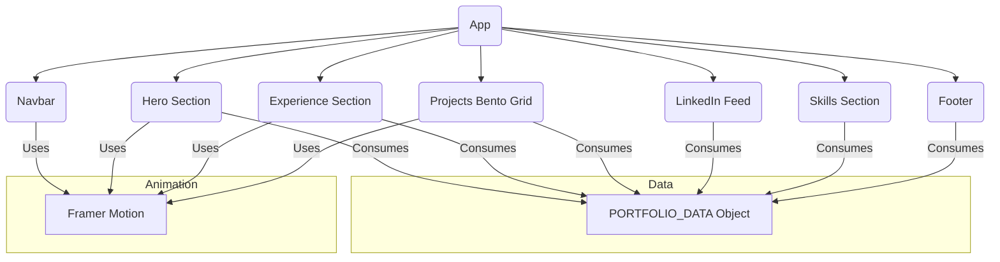

# React Portfolio Website Source Code

## Project Aim
This repository contains the source code for a highly animated and interactive personal portfolio website. The code defines a modern, single-page application designed to showcase professional experience, projects, skills, and social media activity in a visually engaging format.

## Technical Implementation
The project is architected as a single, comprehensive **React component** written in **TypeScript with JSX**. It is designed to be the core of a modern web application and includes:
- **Data-Driven Content:** All personal information (experience, projects, skills) is structured and stored in a single, easy-to-edit JavaScript object.
- **Advanced Animations:** Leverages the **Framer Motion** library to create fluid, professional animations, including text blurs, spotlight effects on cards, and a fluid navigation bar.
- **Component-Based Structure:** The UI is broken down into logical React components (Hero, Experience, Projects, etc.).
- **Modern Styling:** The design is intended to be implemented with a utility-first CSS framework like Tailwind CSS.

**Note:** This repository contains only the primary React source file (`index.ts`). It does not include the necessary project setup, build configuration, or dependencies to run as a standalone website.

## Key Features
- **Bento Grid Layout:** A modern, grid-based layout for showcasing key projects.
- **Simulated Social Feed:** A component that displays recent posts in a style similar to a LinkedIn feed.
- **Interactive UI:** Features include spotlight effects on hover and an animated, pill-style navigation bar.

## Setup Instructions
See source code for usage details. This file is a React component and requires a surrounding React project structure (e.g., using Vite or Next.js) to be rendered.

## System Diagram

